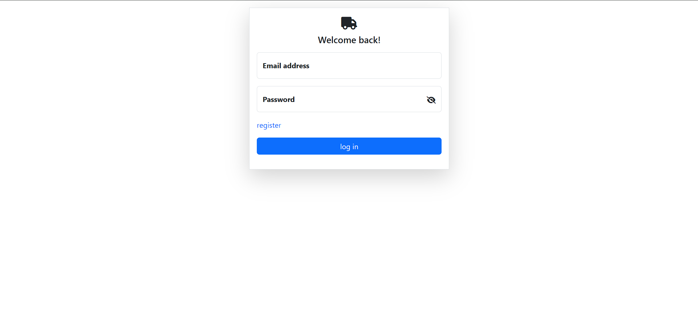
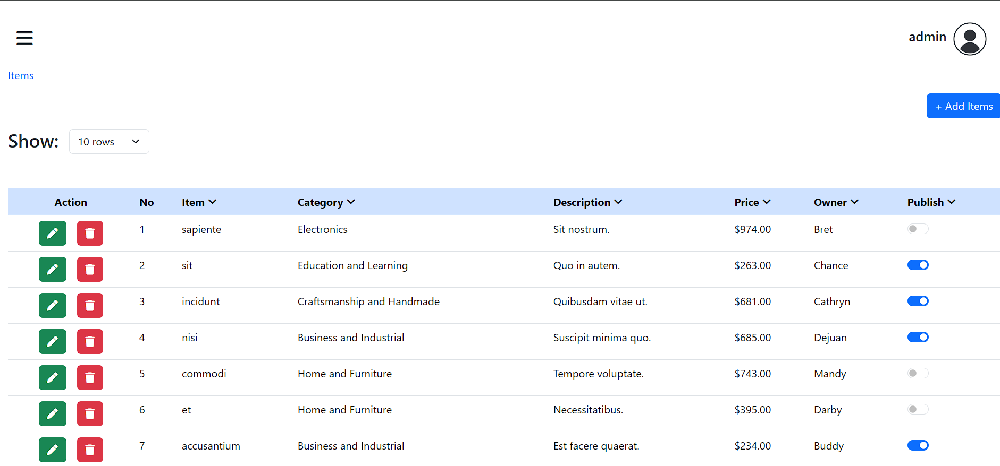
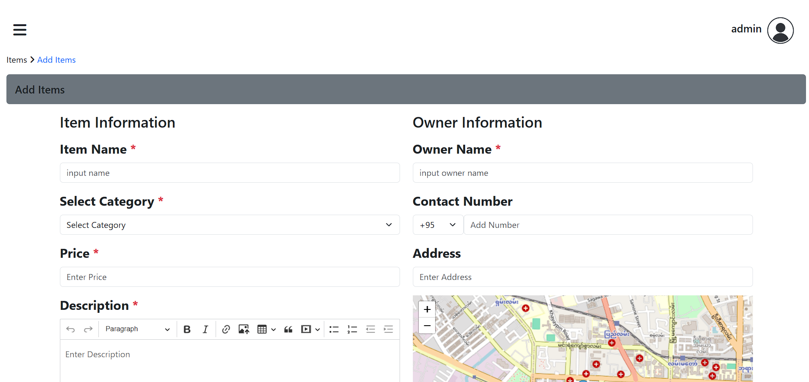
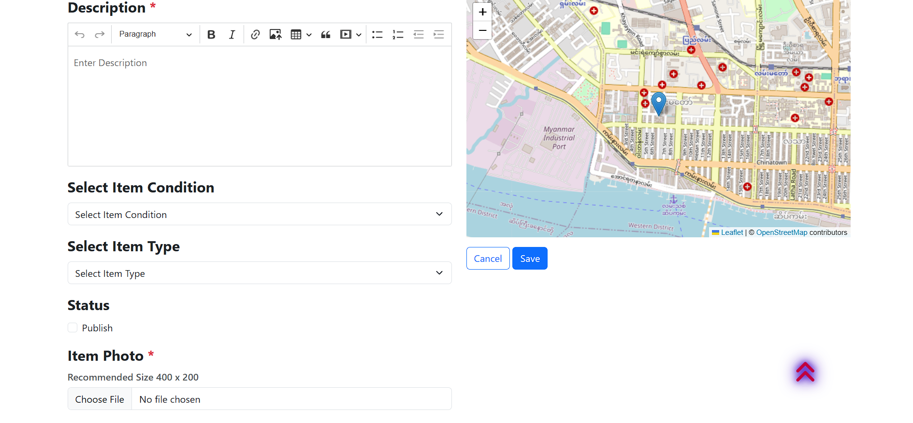
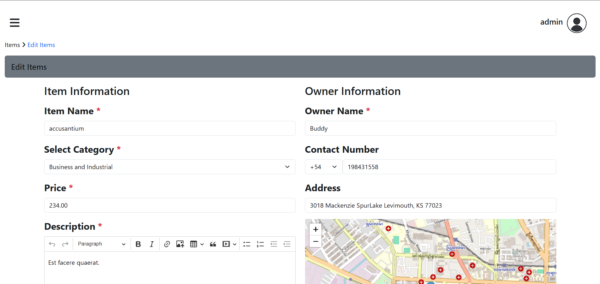
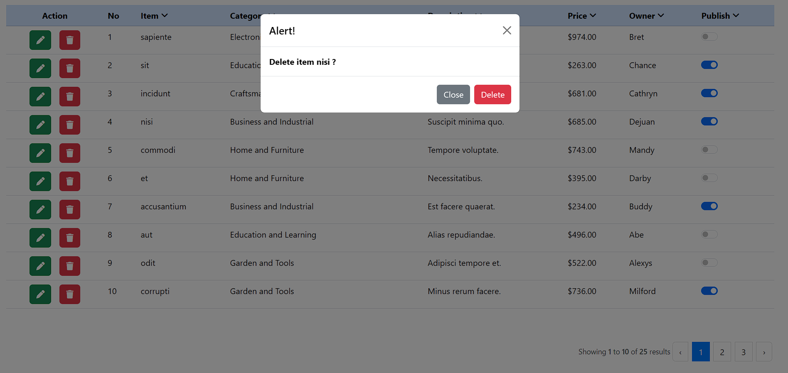
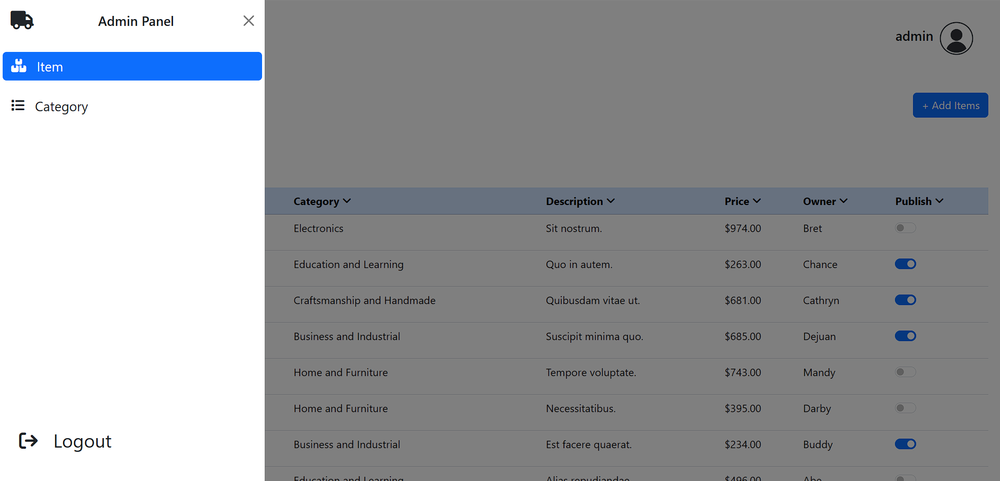
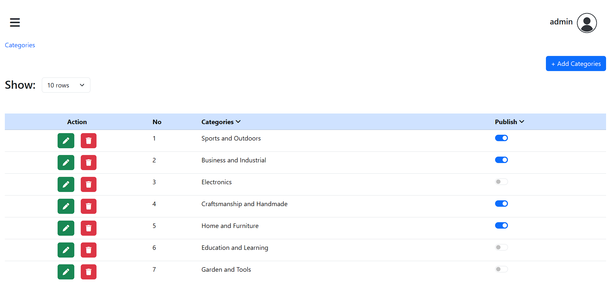
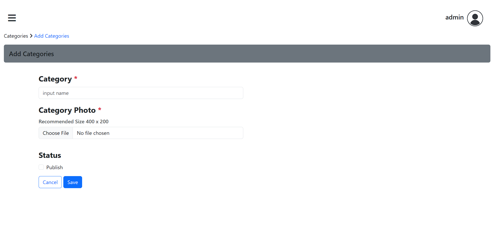

<h1>Documentation for Laravel Admin Panel</h1>
 
 

<h3>Login Page</h3>

 

<h3>Items</h3>

 

<h3>Add Item</h3>

 

<h3>Edit Item</h3>

 

<h3>Delete Item</h3>

 

<h3>Panel Menu</h3>

 

<h3>Categories</h3>

 

<h3>Add Category</h3>

 

